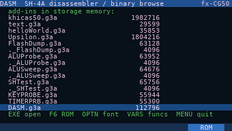
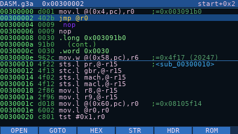
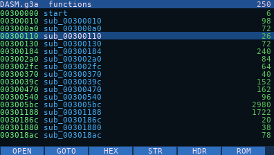
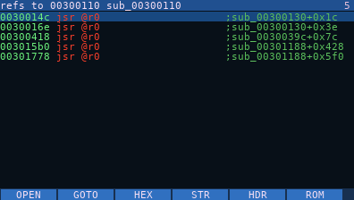
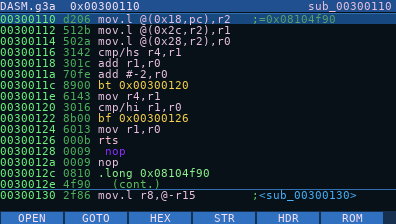
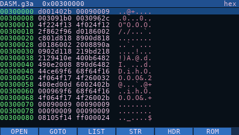
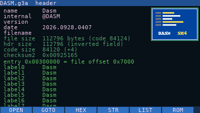
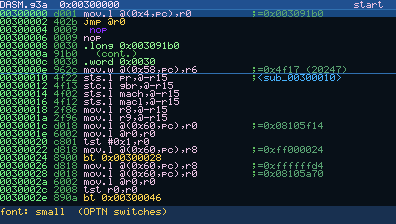

# DASM — an SH-4A disassembler that runs on the fx-CG50

DASM is a gint add-in that turns the Casio fx-CG50 into its own reverse-engineering tool.
Pick any add-in (`.g3a`) in storage memory, or the calculator's OS ROM itself, and browse
it as a colour disassembly listing. Follow calls and jumps, then come back. See every function
in the file and, for any function or address, everything that calls or references it. Read the
literal pools, see which OS syscall is being called, and switch to a hex dump or a strings list.

The screenshots below show DASM disassembling itself.

| | |
|---|---|
|  |  |
| **File picker:** every `.g3a` in storage memory, with sizes | **Listing:** address · opcode · instruction · comment |
|  |  |
| **Functions (VARS):** every function found, with its size | **References (X,θ,T):** everything that calls this function, and from where |
|  |  |
| **Function starts** are marked by a line and their name, and literal pools show as data | **Hex view (F3):** synced to the listing, with ASCII |
|  | |
| **Header (F5):** name, version, sizes, checksum, the add-in's icon | |

## What it can do

- **Open anything:** every `.g3a` in `\\fls0` (read through the OS's BFile calls, cached in
  4 KB pages), or the **OS ROM** mapped at `0x80000000` (F6).
- **Full SH-4A decoding:** the whole integer, system and FPU set plus the SH-4A additions
  (`movli`/`movco`, `movua`, `icbi`, `prefi`, `synco`, banked registers). The decoder was
  checked against an independent disassembler over every one of the 6.3 million instruction
  words in OS 3.60, with no unexplained differences.
- **Literal pools resolved:** `mov.l @(disp,pc),rN` shows the value it loads
  (`;=0x08105f14`), and `mov.w` shows it in decimal too.
- **Calls and jumps followed:** EXE on a `bsr`/`bra`/`bt`/`bf` jumps to the target, and EXIT
  comes back (32 levels of history). `jsr @rN`/`jmp @rN`/`braf`/`bsrf` are resolved by
  scanning back for the load of `rN`.
- **Function detection (VARS):** finds the functions of the file or the OS by following the
  code from its entry points, the same way IDA and Ghidra do (see below). The list shows each
  function's address, name and size, and EXE jumps to it. In the listing, each function start
  gets a separator line and its name, and the title bar shows where you are
  (`sub_00300130+0x1c`).
- **Cross-references (X,θ,T):** everything that refers to an address: `bsr`/`bra`/`bt`/`bf`,
  `jsr`/`jmp` through a register loaded with it, literal loads, `mova`, and pointers in data.
  Each line shows the instruction and the function it is in; EXE goes there. Press X,θ,T again
  on a reference to see who calls *that* function, walking up the call chain.
- **Literal pools as data:** once functions are known, the words after a function's code that
  its `mov.l` instructions load are shown as `.long 0x…`, not decoded as fake instructions.
- **Syscalls named:** OS syscall handlers are named from the running OS's own syscall table,
  so it fits whatever OS version is installed (273 names from libfxcg). An add-in's syscall
  trampolines are resolved to the syscall's name.
- **Readable colours:** calls, branches, returns and literals have their own colours, and delay
  slots are indented.
- **Hex view (F3), strings (F4), header (F5), go to address (F2).**
- **Font setting (OPTN):** switches the listing font, described below.
- **Light or dark theme (S⇔D):** the dark theme is the default; the light one is easier to read
  on the calculator's own screen. DASM remembers the choice, and the debugger uses it too.

## Font setting: OPTN

DASM has two listing fonts. **OPTN** switches between them at any time, and the status bar
confirms which one is active.

| | Large, smooth (default) | Small |
|---|---|---|
| Font | Anti-aliased DejaVu Sans Mono, 7×11 cells | The original 1-bit 5×7 font, 6×8 cells |
| Screen | 56 columns × 17 rows | 64 columns × 24 rows |
| Hex view | 8 bytes per row | 16 bytes per row |

gint fonts are 1-bit, so the large font is drawn by DASM itself. `tools/make_font.py` renders
the 95 printable ASCII glyphs to 8-bit coverage in `src/font_aa.h`, and `aa_text()` in
`src/main.c` blends them into VRAM over whatever is behind them (row highlight, title bar).

## How function detection works

A linear sweep can't tell code from data: tables and literal pools decode as plausible
instructions, and a sweep over DASM's own binary "found" hundreds of fake calls. So DASM does
**recursive traversal**, as IDA and Ghidra do:

1. **Start** from the entry points: the add-in's entry at `0x00300000`, or for the OS ROM the
   reset vector and every handler in the OS's syscall table.
2. **Follow the code** of each function: fall-through, `bt`/`bf`/`bra` targets and gcc's jump
   tables (`mova` + `mov.w @(r0,Rn)` + `braf`, sized from the `cmp/hi` range check), until
   `rts` or `jmp`. `bsr` targets, and `jsr`/`jmp @Rn` targets whose `Rn` was loaded from a
   literal on the same path, become new functions.
3. **Code nothing calls directly:** right after a function's literal pool and padding, a
   *prologue* (a register push or `sts.l pr,@-r15` within the first 3 instructions, all real
   instructions) starts another function. A code address stored in a literal pool or in data
   starts a function if it has that prologue, or if it sits right after another function and
   explores cleanly.

Measured against the ELF symbols of DASM's own build, it finds **88% of the C functions**, with
7 false starts (3 of them are gint's assembly interrupt handlers, which are real code). On OS
3.60 it finds **12,058 functions**, including all but 89 of the 10,242 that Ghidra's own analysis
finds. `tools/proto_funcs.py` is the Python prototype used to tune these rules and score them.

Time on the calculator: a small add-in (DASM itself, 113 KB) takes
well under a second and is analysed as soon as it is opened; khicas (2 MB, read through BFile)
takes about 10 s; the 12 MB OS ROM about 15 s. A progress bar shows while it runs, and EXIT
stops it and keeps what was found. Add-ins over 256 KB and the ROM are analysed the first time
you press VARS or X,θ,T.

## Keys

| Key | In the listing |
|---|---|
| UP / DOWN | previous / next instruction |
| LEFT / RIGHT | previous / next page (SHIFT: ±0x1000) |
| `+` / `-` | shift the listing by one byte |
| EXE | follow the branch, call or literal under the cursor |
| EXIT | go back (history), or to the file picker |
| F1 | open another file (the picker) |
| F2 | go to an address: digits, F1–F6 = A–F, DEL, EXE |
| F3 / F4 / F5 | hex view / strings from here / header |
| F6 | browse the OS ROM |
| VARS | function list (EXE goes to the function, EXIT comes back) |
| X,θ,T | references to the function on the cursor line, or to this instruction's target |
| OPTN | switch the font (large smooth / small) |
| S⇔D | switch the theme (dark / light) |
| MENU | back to the calculator's MAIN MENU |

## Installing

Copy `DASM.g3a` to the calculator in USB mass-storage mode, then start DASM from the MAIN MENU.

## Building

The add-in uses [gint](https://gitea.planet-casio.com/Lephenixnoir/gint) 2.11 and the
[fxSDK](https://gitea.planet-casio.com/Lephenixnoir/fxsdk). With both installed, run
`fxsdk build-cg` in this folder; the output is `DASM.g3a`. fxconv needs Pillow in the first
`python3` on the PATH.

Helper scripts:

| Script | What it does |
|---|---|
| `python3 make_icons.py` | the menu icons |
| `python3 tools/make_font.py` | regenerates `src/font_aa.h` and writes a preview |
| `python3 tools/fetch_syscalls.py` | the syscall names |

## Status and next steps

Verified on a real fx-CG50 (OS 3.60): the browser, including reading every add-in's contents,
function detection and cross-references.
Next: bookmarks and comments saved to a side file (which could also cache the
function table, so the OS ROM doesn't take 15 s each time), and an overview bar of the whole file.
