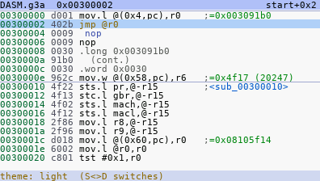
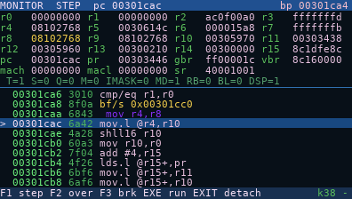
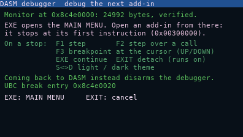

# DASM — an SH-4A disassembler that runs on the fx-CG50

DASM is a gint add-in that turns the Casio fx-CG50 into its own reverse-engineering tool.
Pick any add-in (`.g3a`) in storage memory, or the calculator's OS ROM itself, and browse
it as a colour disassembly listing. Follow calls and jumps, then come back. See every function
in the file and, for any function or address, everything that calls or references it. Read the
literal pools, see which OS syscall is being called, and switch to a hex dump or a strings list.
It also has a **debugger**: start any add-in under it and it stops at its first instruction, so
you can step through it, set a breakpoint and read the CPU registers.

DASM was developed and tested largely on the [casio-cg50](https://github.com/hexbinoct/casio-cg50)
fx-CG50 emulator, which runs the calculator's own OS. Every screen below is a screenshot from it.
DASM is disassembling itself in all of them except the debugger, which is stopped inside a small
test add-in of ours.

| | |
|---|---|
|  |  |
| **File picker:** every `.g3a` in storage memory, with sizes | **Listing:** address · opcode · instruction · comment |
|  |  |
| **Functions (VARS):** every function found, with its size | **References (X,θ,T):** everything that calls this function, and from where |
|  |  |
| **Function starts** are marked by a line and their name, and literal pools show as data | **Hex view (F3):** synced to the listing, with ASCII |
|  |  |
| **Header (F5):** name, version, sizes, checksum, the add-in's icon | **Light theme (S⇔D):** easier to read on the calculator's own screen |
|  |  |
| **Debugger:** registers (changed ones in yellow), flags, and the code with PC marked | **F2 in the file picker** arms the debugger for the next add-in you open |

## What it can do

- **Open anything:** every `.g3a` in `\\fls0` (read through the OS's BFile calls, cached in
  4 KB pages), or the **OS ROM** mapped at `0x80000000` (F6).
- **Full SH-4A decoding:** the whole integer, system and FPU set plus the SH-4A additions
  (`movli`/`movco`, `movua`, `icbi`, `prefi`, `synco`, banked registers). The decoder was
  checked against an independent disassembler over every one of the 6.3 million instruction
  words in OS 3.60, with no unexplained differences.
- **Literal pools resolved:** `mov.l @(disp,pc),rN` shows the value it loads
  (`;=0x08105f14`), and `mov.w` shows it in decimal too.
- **Calls and jumps followed:** EXE on a `bsr`/`bra`/`bt`/`bf` jumps to the target, and EXIT
  comes back (32 levels of history). `jsr @rN`/`jmp @rN`/`braf`/`bsrf` are resolved by
  scanning back for the load of `rN`.
- **Function detection (VARS):** finds the functions of the file or the OS by following the
  code from its entry points, the same way IDA and Ghidra do (see below). The list shows each
  function's address, name and size, and EXE jumps to it. In the listing, each function start
  gets a separator line and its name, and the title bar shows where you are
  (`sub_00300130+0x1c`).
- **Cross-references (X,θ,T):** everything that refers to an address: `bsr`/`bra`/`bt`/`bf`,
  `jsr`/`jmp` through a register loaded with it, literal loads, `mova`, and pointers in data.
  Each line shows the instruction and the function it is in; EXE goes there. Press X,θ,T again
  on a reference to see who calls *that* function, walking up the call chain.
- **Literal pools as data:** once functions are known, the words after a function's code that
  its `mov.l` instructions load are shown as `.long 0x…`, not decoded as fake instructions.
- **Syscalls named:** OS syscall handlers are named from the running OS's own syscall table,
  so it fits whatever OS version is installed (273 names from libfxcg). An add-in's syscall
  trampolines are resolved to the syscall's name.
- **Readable colours:** calls, branches, returns and literals have their own colours, and delay
  slots are indented.
- **Hex view (F3), strings (F4), header (F5), go to address (F2).**
- **Debugger (F2 in the file picker):** stops the next add-in you open at its first instruction;
  then single step, step over calls, one breakpoint, continue. Described below.
- **Font setting (OPTN):** switches the listing font, described below.
- **Light or dark theme (S⇔D):** the dark theme is the default; the light one is easier to read
  on the calculator's own screen. DASM remembers the choice, and the debugger uses it too.

## Font setting: OPTN

DASM has two listing fonts. **OPTN** switches between them at any time, and the status bar
confirms which one is active.

| | Large, smooth (default) | Small |
|---|---|---|
| Font | Anti-aliased DejaVu Sans Mono, 7×11 cells | The original 1-bit 5×7 font, 6×8 cells |
| Screen | 56 columns × 17 rows | 64 columns × 24 rows |
| Hex view | 8 bytes per row | 16 bytes per row |


gint fonts are 1-bit, so the large font is drawn by DASM itself. `tools/make_font.py` renders
the 95 printable ASCII glyphs to 8-bit coverage in `src/font_aa.h`, and `aa_text()` in
`src/main.c` blends them into VRAM over whatever is behind them (row highlight, title bar).

## How function detection works

A linear sweep can't tell code from data: tables and literal pools decode as plausible
instructions, and a sweep over DASM's own binary "found" hundreds of fake calls. So DASM does
**recursive traversal**, as IDA and Ghidra do:

1. **Start** from the entry points: the add-in's entry at `0x00300000`, or for the OS ROM the
   reset vector and every handler in the OS's syscall table.
2. **Follow the code** of each function: fall-through, `bt`/`bf`/`bra` targets and gcc's jump
   tables (`mova` + `mov.w @(r0,Rn)` + `braf`, sized from the `cmp/hi` range check), until
   `rts` or `jmp`. `bsr` targets, and `jsr`/`jmp @Rn` targets whose `Rn` was loaded from a
   literal on the same path, become new functions.
3. **Code nothing calls directly:** right after a function's literal pool and padding, a
   *prologue* (a register push or `sts.l pr,@-r15` within the first 3 instructions, all real
   instructions) starts another function. A code address stored in a literal pool or in data
   starts a function if it has that prologue, or if it sits right after another function and
   explores cleanly.

Measured against the ELF symbols of DASM's own build, it finds **88% of the C functions**, with
7 false starts (3 of them are gint's assembly interrupt handlers, which are real code). On OS
3.60 it finds **12,058 functions**, including all but 89 of the 10,242 that Ghidra's own analysis
finds. `tools/proto_funcs.py` is the Python prototype used to tune these rules and score them.

Time on the calculator: a small add-in (DASM itself, 113 KB) takes
well under a second and is analysed as soon as it is opened; khicas (2 MB, read through BFile)
takes about 10 s; the 12 MB OS ROM about 15 s. A progress bar shows while it runs, and EXIT
stops it and keeps what was found. Add-ins over 256 KB and the ROM are analysed the first time
you press VARS or X,θ,T.

## Debugger

The debugger uses the CPU's own breakpoint hardware (the SH7305's User Break Controller), so the
program being debugged is not modified.

1. In DASM's file picker, press **F2**. DASM copies a small resident *monitor* (about 25 KB) into
   a part of RAM that neither the OS nor add-ins use (`0x8C4E0000`–`0x8C7FFFFF`, checked on a
   real calculator), and explains the keys.
2. Press **EXE**. DASM sets a breakpoint on `0x00300000`, where every add-in starts, and opens the
   MAIN MENU.
3. Open any add-in. It stops at its first instruction, and the monitor shows the registers, the
   status flags and the code around PC.

| Key | On a stop |
|---|---|
| F1 | single step (one instruction; a branch together with its delay slot) |
| F2 | step over a call (`bsr`/`jsr`/`bsrf`): run it and stop after its delay slot |
| UP / DOWN, LEFT / RIGHT | move the cursor / a page through the code |
| F3 | set the breakpoint at the cursor (F3 on it again removes it) |
| EXE | continue until the breakpoint |
| EXIT | detach: the add-in runs on normally |
| S⇔D | switch the theme |

Going back to DASM from the MAIN MENU, instead of opening another add-in, disarms the debugger.

Limits, for now: one breakpoint (the controller has two channels, and stepping needs the other),
and the add-in's timers and interrupts are paused while it is stopped. Verified on a real fx-CG50
with OS 3.60. If the calculator ever freezes, the RESTART button on its back recovers it without
losing anything.

The **sin** key runs the debugger's self-test: a breakpoint in DASM's own code, with the registers
and single steps.

## Keys

| Key | In the listing |
|---|---|
| UP / DOWN | previous / next instruction |
| LEFT / RIGHT | previous / next page (SHIFT: ±0x1000) |
| `+` / `-` | shift the listing by one byte |
| EXE | follow the branch, call or literal under the cursor |
| EXIT | go back (history), or to the file picker |
| F1 | open another file (the picker) |
| F2 | go to an address: digits, F1–F6 = A–F, DEL, EXE |
| F3 / F4 / F5 | hex view / strings from here / header |
| F6 | browse the OS ROM |
| VARS | function list (EXE goes to the function, EXIT comes back) |
| X,θ,T | references to the function on the cursor line, or to this instruction's target |
| OPTN | switch the font (large smooth / small) |
| S⇔D | switch the theme (dark / light) |
| MENU | back to the calculator's MAIN MENU |

In the file picker: EXE opens the file, F2 starts the debugger, F6 opens the OS ROM.

## Installing

1. Connect the calculator by USB and choose **USB Flash** (F1) on the calculator's screen.
2. Copy `DASM.g3a` to the calculator's drive (the top folder).
3. Eject the drive, then start DASM from the MAIN MENU.

On macOS, copy it with `cp -X DASM.g3a "/Volumes/<drive>/"`. A copy from Finder can add a hidden
`._DASM.g3a` file next to it. Delete that file: it would show up in the MAIN MENU and in DASM's
file picker.

## Building

`DASM.g3a` is in the repository, ready to copy. You only need to build it if you change the code.

DASM is a [gint](https://git.planet-casio.com/Lephenixnoir/gint) add-in (gint 2.11 or newer), built
with the [fxSDK](https://git.planet-casio.com/Lephenixnoir/fxsdk). Both are installed with
GiteaPC, Planète Casio's package tool, which builds a SuperH cross-compiler (`sh-elf-gcc`) from
source. Allow 30–60 minutes for that the first time.

**1. Prerequisites.** Linux, or Windows with WSL (Ubuntu). On Debian/Ubuntu:

```sh
sudo apt install curl git python3 python3-pil build-essential cmake pkg-config flex texinfo \
    libmpfr-dev libmpc-dev libgmp-dev libpng-dev libppl-dev libusb-1.0-0-dev libudisks2-dev libglib2.0-dev
```

**2. GiteaPC, the fxSDK, the compiler and gint:**

```sh
curl "https://git.planet-casio.com/Lephenixnoir/GiteaPC/raw/branch/master/install.sh" -o /tmp/giteapc-install.sh
bash /tmp/giteapc-install.sh
giteapc install Lephenixnoir/fxsdk Lephenixnoir/sh-elf-binutils Lephenixnoir/sh-elf-gcc
giteapc install Lephenixnoir/OpenLibm Vhex-Kernel-Core/fxlibc Lephenixnoir/gint
```

The tools go into `~/.local/bin`, which must be on your `PATH`; the installer offers to add it.
The fxSDK's own README covers other systems and the problems people hit.

**3. Build DASM:**

```sh
git clone https://github.com/hexbinoct/cg50-dasm.git
cd cg50-dasm
fxsdk build-cg
```

The result is `DASM.g3a` in that folder. The build also compiles the debugger's monitor
(`monitor/`) into `monitor.bin` and embeds it in the add-in. If a build was configured on another
machine, delete `build-cg/` and run `fxsdk build-cg` again.

**macOS** works with a few extra steps, because the macOS defaults trip up the toolchain build:
- install the build dependencies with Homebrew (`python3 cmake libusb libpng pkg-config gmp mpfr
  libmpc texinfo bash gnu-getopt`), and put Homebrew's `bash` and `gnu-getopt` before the system
  ones on your `PATH` (the fxSDK scripts need bash 4 and GNU `getopt`);
- build on a case-sensitive volume, because GCC and binutils fail on the default case-insensitive
  disk. An APFS volume in the same container costs no fixed space:
  `diskutil apfs addVolume disk3 "Case-sensitive APFS" fxsdkbuild`, then set
  `GITEAPC_HOME=/Volumes/fxsdkbuild/giteapc-repos` before the `giteapc` commands;
- the first `python3` on your `PATH` must have Pillow (`python3 -m pip install pillow`), because
  the fxSDK's asset converter needs it for DASM's font.
- with Xcode's clang 21 (2026), three more fixes were needed: `--with-system-zlib` added to the
  configure flags in `sh-elf-binutils/configure.sh` and `sh-elf-gcc/configure.sh`, and a
  `giteapc-config.make` in the fxsdk repository containing
  `FXSDK_CONFIGURE := -DFXLINK_DISABLE_UDISKS2=1` (UDisks2 exists only on Linux).

## Helper scripts

None of these is needed to build DASM.

| Script | What it does |
|---|---|
| `python3 make_icons.py` | draws the menu icons (`assets-cg/icon-*.png`) |
| `python3 tools/make_font.py` | regenerates the large font, `src/font_aa.h`, from DejaVu Sans Mono |
| `python3 tools/fetch_syscalls.py` | regenerates the syscall names, `src/syscall_names.h`, from libfxcg |
| `python3 tools/readme_shots.py` | retakes the README screenshots on the emulator |
| `python3 tools/verify_decoder.py` | compares DASM's decoder with the emulator's disassembler |
| `python3 tools/proto_funcs.py` | the function-detection prototype and its score |

The last three need the [casio-cg50](https://github.com/hexbinoct/casio-cg50) emulator: put the
path of your checkout in `tools/emulator_path.txt` (see `tools/emulator_path.example.txt`). Anything
that runs the calculator's OS needs a flash dump of your own calculator, set up as the emulator's
README describes. Neither repository contains any Casio firmware.

## Status and next steps

Verified on a real fx-CG50 (OS 3.60): the browser, including reading every add-in's contents,
function detection, cross-references, both themes and the debugger.

Next:
- **Debugger:** unlimited breakpoints (by running the add-in's code from a copy in RAM),
  watchpoints on memory, and DASM's full listing on a stop.
- **Browser:** bookmarks and comments saved to a side file (which could also cache the function
  table, so the OS ROM doesn't take 15 s each time), and an overview bar of the whole file.

## Credits

- [casio-cg50](https://github.com/hexbinoct/casio-cg50), the fx-CG50 emulator that DASM was
  developed and tested on: the add-in, its debugger and the decoder were all run there first.
- [gint](https://git.planet-casio.com/Lephenixnoir/gint) and the
  [fxSDK](https://git.planet-casio.com/Lephenixnoir/fxsdk) by Lephenixnoir: the kernel DASM runs
  on, and its build tools.
- [libfxcg](https://github.com/Jonimoose/libfxcg): the syscall names.
- [DejaVu Sans Mono](https://dejavu-fonts.github.io/): the large font (Bitstream Vera licence and
  public domain).

## Licence

MIT: see [LICENSE](LICENSE).
